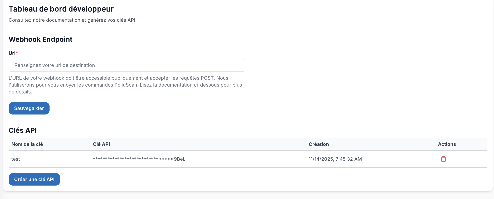

## Configuration des webhooks

### 1. Accéder à l'espace développeur

1. Connectez-vous à votre compte PolluScan
2. Dans le menu principal, rendez-vous sur la page developer
3. Ajouter un nouveau webhook

Saisissez l'URL publique de votre endpoint webhook puis cliquez sur **Sauvgarder**.
